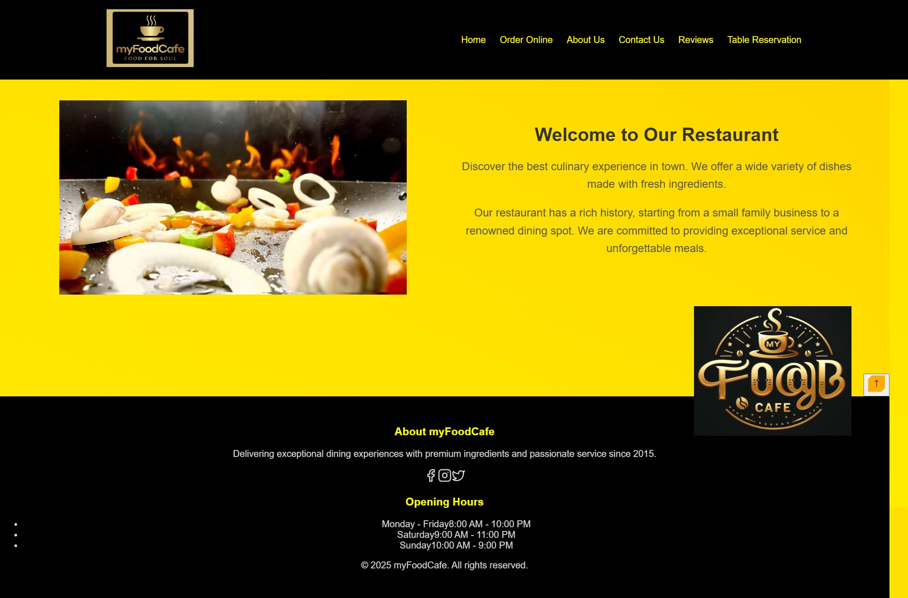

# Project Work

## MyFoodCafe
**Description**: A dynamic, responsive restaurant website built as my LaunchCode capstone project using **React**, **JavaScript**, **HTML**, and **CSS**. Features Home, Menu, Contact, and Online Ordering pages with a neon green-themed UI, designed for small businesses to enhance customer engagement. The project demonstrates reusable components, state management, and mobile responsiveness.

 <!-- Placeholder for screenshot, upload to assets/images -->

**Links**:  
- [Live Site](https://myfoodcafeforlaunchcode.netlify.app/)  
- [GitHub Repository](https://github.com/DeepaLaunchCode)
